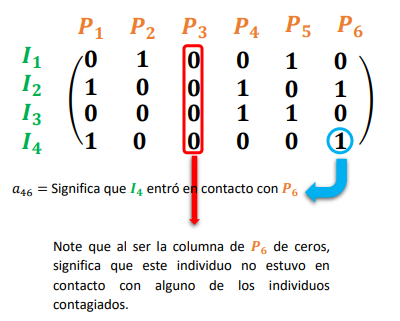
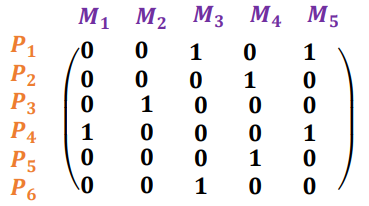

> Sede San Carlos
\
> Matematica para Ciencia de los Datos
\
> Tarea Matrices
\
> Autor: Andres Gonzalez
\
> 2019

``` {r echo = FALSE, message = FALSE}
library(pracma)
library(mosaic)
library(MASS)
```

### I Parte

\

**1.** Sea $P = (2,3), Q = (5,2), R = (2,-5) y S = (1, -2)$. Calcule $proy_{\vec{PQ}}\vec{RS}$


```{r}
p = c(2,3); q = c(5,2); r = c(2, -5); s = c(1,-2)
pq <- q-p
pq
rs <- s-r
rs
fractions(project(rs,pq))
```

\

**2.** Sea $u = (-2,1,6)$ y $v = (2,4,5)$, comprueba que el vector $w$ dado por:

\

$w = u-\frac{u\cdot v}{||v||^{2}}v$

\

Es un vector ortogonal con v.

```{r}
u <- c(-2,1,6)
v <- c(2,4,5)
uv_prod <- sum(u*v)
v_norm <- norm(v, type = "2")^2
w <- fractions(u-((uv_prod / v_norm)*v))
w
# Revisar si w es vector ortogonal con v
wv_prod <- sum(w*v)
wv_prod
180*subspace(as.matrix(w),as.matrix(v))/pi
# El producto punto entre w y v da cero y el angulo entre los vectores es 90, por lo tanto w es ortogonal a v
```
\

**3.** Sean $A = (3,0,0), B = (1,0,2), C = (2,3,0)$ puntos en el espacio ($R^3$). Con estos puntos:

|        **a.** Determine si el triangulo $ABC$ es rectangulo, obtusangulo o acutangulo.

|        **b.** Determine el perimetro del triangulo $ABC$.

|        **c.** Determine el area del triangulo ABC

\

```{r}
a <- c(3,0,0); b = c(1,0,2); c = c(2,3,0)

ab <- b-a
ac <- c-a
bc <- c-b

180*subspace(as.matrix(ab), as.matrix(ac))/pi
180*subspace(as.matrix(ab), as.matrix(bc))/pi
180*subspace(as.matrix(ac), as.matrix(bc))/pi
```

**Todos los lados del angulo miden menos de 90° por lo tanto es un triangulo acutangulo**

```{r}
ab_norm <- norm(ab, type = "2")
ac_norm <- norm(ac, type = "2")
bc_norm <- norm(bc, type = "2")
perimetro <- ab_norm + ac_norm + bc_norm
perimetro
# Calculamos semiperimetro
s <- perimetro / 2
# Calculamos area usando formula de heron
area2 <- sqrt(s*(s-ab_norm)*(s-ac_norm)*(s-bc_norm))
area2
```

\

### II Parte

\

**1.** Pruebe que la matrix $P$, es ortogonal

\

```{r}
p <- matrix(c(1/2,1/2,1/2,1/2,1/sqrt(2),-1/sqrt(2),0,0,1/sqrt(6),1/sqrt(6),-2/sqrt(6),0,1/(2*sqrt(3)),1/(2*sqrt(3)),1/(2*sqrt(3)),-3/(2*sqrt(3))),nrow = 4, ncol = 4, byrow = TRUE)
fractions(p)
p_inversa <- solve(p)
fractions(p_inversa)
p_transpuesta <- t(p)
fractions(p_transpuesta)
# Comparar si son iguales
all.equal(p_inversa, p_transpuesta)
```
**La matriz inversa de P y la matriz transpuesta de P son identicas por lo tanto la matriz P es ortogonal**

\

**2.** Sea la matriz $$A=\left(\begin{array}{cc} 
2 & -2 & -4\\
-1 & 3 & 4\\
1 & -2 & -3
\end{array}\right)$$
Demuestre que $A$ es idempotente.

```{r}
a <- matrix(c(2,-2,-4,-1,3,4,1,-2,-3), nrow = 3, ncol = 3, byrow = TRUE)
a_cuadrado = a%*%a
a_cuadrado
all.equal(a_cuadrado,a)
```
**La matriz A al cuadrado es igual a la matriz A, por lo tanto la matriz A es idempotente**

\

**3.** Sean $$m=\left(\begin{array}{cc} 
\frac{3}{2} & \frac{-5}{2}\\
\frac{2}{3} & \frac{-1}{3}\\
\end{array}\right)$$
y $f(x)=6x^3+3x^2-x$
Determine la composicion f(m)

```{r}
m = matrix(c(3/2,-5/2,2/3,-1/3), nrow = 2, ncol = 2, byrow = TRUE)
fractions((6*m%*%m%*%m)+(3*m%*%m)-m)
```

**4.** Encuentre la matriz inversa y el determinante de cada una de las siguientes matrices:

$$A=\left(\begin{array}{cc} 
1 & 2 & 3\\
2 & 5 & 7\\
-2 & -4 & -5
\end{array}\right)$$

$$B=\left(\begin{array}{cc} 
3 & -2 & -1\\
-4 & 1 & -1\\
2 & 0 & 1
\end{array}\right)$$

$$C=\left(\begin{array}{cc} 
0 & 2 & 1\\
1 & 3 & -1\\
-1 & 1 & 2
\end{array}\right)$$

$$D=\left(\begin{array}{cc} 
3 & 6 & 9\\
2 & 5 & 1\\
1 & 1 & 8
\end{array}\right)$$

**¿Que relacion existe entre las matrices que poseen inversas y el valor de su determinante? Sug: revisar la teoría vista en clase.**

**Respuesta:** Que las determinantes de las matrices que poseen inversa son mayores a cero.

\

```{r}
a = matrix(c(1,2,3,2,5,7,-2,-4,-5), 3, 3, TRUE)
b = matrix(c(3,-2,-1,-4,1,-1,2,0,1), 3, 3, TRUE)
c = matrix(c(0,2,1,1,3,-1,-1,1,2), 3, 3, TRUE)
d = matrix(c(3,6,9,2,5,1,1,1,8), 3, 3, TRUE)

det(a)
det(b)
det(c)
det(d)

# Inversa de A
solve(a)
# Inversa de B
solve(b)
#Inversa de C
fractions(solve(c))
```

**La inversa de D no se puede calcular porque el determinante es 0, es decir la matriz es singular o invertible**

\

**5.** ¿Como se propaga una enfermedad contagiosa?. Suponga que un grupo de 4 individuos que llamaremos $I_{1},I_{2},I_{3},I_{4}$, han contraído una enfermedad.

Este grupo entra en contacto con 6 personas de un segundo grupo: $P_{1},P_{2},P_{3},P_{4},P_{5},P_{6}$. Este tipo de contactos se llaman directos y se pueden representar en una matriz de 4x6, como la que se muestra a continuacion:

<center></center>

Note que la forma de construir dicha matriz es, colocando un 1 si una persona del primer grupo (contagiados) entra en contacto con alguna persona del segundo grupo.

Llamemos $A$ a esta matriz de contactos Primer Contacto Directo:

$$A=\left(\begin{array}{cc} 
0 & 1 & 0 & 0 & 1 & 0\\
1 & 0 & 0 & 1 & 0 & 1\\
0 & 0 & 0 & 1 & 1 & 0\\
1 & 0 & 0 & 0 & 0 & 1
\end{array}\right)$$

Ahora suponga que las 6 personas del grupo 2 entro en contacto directo con un tercer grupo de cinco personas $M_{1},M_{2},M_{3},M_{4},M_{5}$, de la siguiente manera:

<center></center>

Llamamos $B$ a esta segunda matriz de contacto:

$$B=\left(\begin{array}{cc} 
0 & 0 & 1 & 0 & 1\\
0 & 0 & 0 & 1 & 0\\
0 & 1 & 0 & 0 & 0\\
1 & 0 & 0 & 0 & 1\\
0 & 0 & 0 & 1 & 0\\
0 & 0 & 1 & 0 & 0
\end{array}\right)$$

La logica es igual que en el caso anterior, 1 significa que un individuo del segundo grupo estuvo en contacto con un individuo del tercer grupo.

Los contactos indirectos o de segundo orden, se pueden dar entre individuos del primer grupo con individuos del tercer grupo, esto es, que una persona del grupo 3, puede ser contagiada por alguien del grupo 2 que a su vez fue contagiada por alguien del grupo 1.

A manera de ejemplo, note que las posiciones $a_{24}=1$ y $b_{45}=1$, con esto, se ve que indirectamente la quinta persona del grupo 3, tuvo contacto con una eprsona del grupo 1 a traves de la cuarta persona del grupo 2, asi:
$I_{2}\Rightarrow P_{4}\Rightarrow M_{5}$

Con respecto al caso anterior, realice lo siguiente:

|        **a.** Calcule una nueva matriz $C$, tal que $C=A\cdot B$ (Tome en cuenta que el producto es matricial, al trabajarlo en R).

\

```{r}
# a
a_dimnames = list(
  c("I1", "I2", "I3", "I4"),
  c("P1", "P2", "P3", "P4", "P5", "P6")
)

b_dimnames = list(
  c("P1", "P2", "P3", "P4", "P5", "P6"),
  c("M1", "M2", "M3", "M4", "M5")
)

a <- matrix(c(
  0,1,0,0,1,0,
  1,0,0,1,0,1,
  0,0,0,1,1,0,
  1,0,0,0,0,1
), nrow = 4, ncol = 6, byrow = TRUE, dimnames = a_dimnames)
a

b <- matrix(c(
  0,0,1,0,1,
  0,0,0,1,0,
  0,1,0,0,0,
  1,0,0,0,1,
  0,0,0,1,0,
  0,0,1,0,0
), nrow = 6, ncol = 5, byrow = TRUE, dimnames = b_dimnames)
b

c <- a%*%b
c
```

\

|        **b.** ¿Cuales grupos de individuos (Grupo 1, 2 o 3) estan quedando representados en $C$?, ¿Quienes estan representados en las filas y quienes en las columnas?

\

La **filas** representan a los individuos del grupo $I$ y la sumatoria es cuantos contactos indirectos a traves de $P$ tuvo el individuo $I_{n}$ con individuos del grupo $M$

Las **columnas** representan a los individuos del grupo $M$ y la sumatoria es cuantos contactos indirectos a traves de $P$ tuvo el individuo $M_{n}$ con individuos del grupo $I$.

Se podría decir que $P$ esta representado ya que cada entrada de la matriz $C$ es la cantidad de contactos de $M_{n}$ con individuos del grupo $P$ a traves de un $I_{n}$

Por lo tanto todos los grupos estan representados.

\

|        **c.** Tome en la fila 2 de $C$ e interpretela (haga la extraccion de esta usando un comando apropiado de R).

\

```{r}
c[2,]
```

\

La fila 2 representa la cantidad de contactos indirectos a traves de individuos del grupo $P$ que tuvo el individuo $I_{2}$ con individuos del grupo $M$

También $I_{2}$ es quien más contactos indirectos con individuos del grupo $M$ ha tenido.

\

|        **d.** Tome la columna 2 y 5 de $C$ e interpretelas (Use comandos apropiados en R para la extraccion).

\

```{r}
c[,c(2,5)]
```

\

El individuo $M_{2}$ no tuvo contactos con indirectos a traves de $P$ con individuos del grupo $I$, por lo tanto no se contagio.
El individuo $M_{5}$ tuvo dos contactos indirectos con $I_{2}$, uno con $I_{3}$ y uno con $I_{4}$, haciendolo el individuo del grupo $M$ con más contactos indirectos con indivuos del grupo $I$.

\

|        **e** Interprete la posicion $C_{43}$ (Extraiga la entrada, usando el comando apropiado en R).

\

```{r}
c[4,3]
```

\

El individuo $M_{3}$ tuvo 2 contactos indirectos con $I_{4}$ a traves de individuos del grupo $P$. 


\