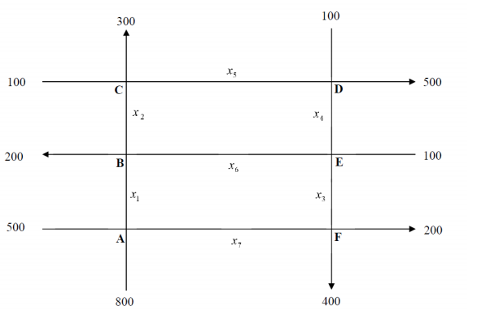

> Sede San Carlos
\
> Matematica para Ciencia de los Datos
\
> Proyecto I
\
> Autor: Andres Gonzalez
\
> 2019

``` {r echo = FALSE, message = FALSE}
library(pracma)
library(mosaic)
library(MASS)
```

<hr>

### I Parte

\

**1.** En una tienda especializada en la preparacion de mezclas de cafe para conocedores, el dueño desea preparar bolsas de un kilogramo para venderlas a \$3.5 usando las variedades de cafe colombiano, brasileño, y de Kenia. El costo por kilogramo de cada uno de estos tres tipos de cafe es respectivamente \$4, \$2 y \$3.

|        **a)** Muestre que se debe usar al menos $\frac{1}{2}kg$ de cafe colombiano y a lo sumo $\frac{1}{4}kg$ de cafe brasileño.

\

Sea $x$ kg de cafe colombiano, $y$ kg de cafe brasileño y $z$ kg de cafe de Kenia.

```{r}
sistema = matrix(c(
  1,1,1,1,
  4,2,3,3.5
), 2, 4, TRUE)

fractions(rref(sistema))
```

Tenemos entonces que: 
\
$x+\frac{z}{2}=\frac{3}{4}$
\
$y+\frac{z}{2}=\frac{1}{4}$

\
Por lo tanto el valor minimo del cafe de Kenia ($z$) debe ser cero ya que no puede ser cantidades negativas de kilogramos para $z$, para que esto se cumpla la cantidad maxima de cafe brasileño ($y$), debe ser $\frac{1}{4}$, ya que si es mayor, $z$ seria negativo.

\
Luego el valor minimo de cafe colombiano ($x$) debe ser de $\frac{1}{2}$ ya que si es menor que esto la cantidad del cafe brasileño ($y$) seria negativo. Por lo tanto si la cantidad del cafe colombiano es de $\frac{1}{2}$ entonces la cantidad maxima del cafe de Kenia ($z$) seria de $\frac{1}{2}$.

\

Por lo tanto $0<=z<=\frac{1}{2}$

\

|        **b)** Determine la cantidad de cada tipo de cafe suponiendo que el dueño decide usar $\frac{1}{8}kg$ de cafe brasileño.

\

Sea $x$ kg de cafe colombiano, $y$ kg de cafe brasileño y $z$ kg de cafe de Kenia.
\
Si tenemos:
$x+\frac{z}{2}=\frac{3}{4}$
\
$y+\frac{z}{2}=\frac{1}{4}$

\

Entonces sustituyendo $\frac{1}{8}$ por ($y$), nos da que la cantidad de cafe colombiano ($x$) es de $\frac{5}{8}$ y la cantidad de cafe de Kenia ($z$), es de $\frac{1}{4}$.


<hr>

### II Parte

\

**1.** Imagine que en un sector determinado de una ciudad, se hizo u estudio sobre el fluido de tránsito de las calles y las avenidas. Supongamos que en un sector de estas vías se pretende realizar reparaciones en el sistema de alcantarillado, por lo que habrá tránsito regulado. En la figura siguiente se muestra el comportamiento de estas vías en las horas pico. Suponiendo que los trabajos de reparación se realizarán en la calle $x_5$, entonces los oficiales de tránsito pueden hasta cierto punto, controlar el flujo de vehículos reajustando los semáforos, colocando policías en los cruces claves o cerrando la calle crítica al tránsito de vehículos. Note que si se disminuye el tránsito en $x_5$, aumentará instantáneamente el flujo de tránsito en las otras calles aledañas. Dadas las circunstancias, minimice el tránsito en $x_5$ de manera que no ocasione congestionamientos en las otras calles.

<center></center>

\

**A.** 

|        $x_1+x_7=500+800$

|        $x_1+x_7=1300$

\

**B.** 

|        $x_1+x_6=200+x2$

|        $x_1-x_2+x_6=200$

\

**C.** 

|        $x_2+100=x_5+300$

|        $x_2-x_5=200$

\

**D.** 

|        $x_5+100=x_4+500$

|        $-x_4+x_5=400$

\

**E.** 

|        $x_4+100=x_6+x3$

|        $x_3-x_4+x_6=100$

\

**F.** 

|        $x_3+x_7=400+200$

|        $x_3+x_7=600$

\

### Resolver sistema

\

```{r}
sistema <- matrix(c(1,0,0,0,0,0,1,1300,
                    1,-1,0,0,0,1,0,200,
                    0,1,0,0,-1,0,0,200,
                    0,0,0,-1,1,0,0,400,
                    0,0,1,-1,0,1,0,100,
                    0,0,1,0,0,0,1,600), 6, 8, TRUE)
sistema
rref(sistema)
```

\

**(1)**

|        $x_1+x_7=1300$

\

**(2)**

|        $x_2-x_6+x_7=1100$

\

**(3)**

|        $x_3+x_7=600$

\

**(4)**

|        $x_4-x_6+x_7=500$

\

**(5)**

|        $x_5-x_6+x_7=900$

\

**Conclusiones: ** de **(2)**, **(4)** y **(5)** se concluye que el valor minimo que puede tomar $-x_6+x_7$ para minimizar $x5$, es $-x_6+x_7=500$, por tanto $x_4=0$

**Luego:**

\

|        $x_5=400$

|        $x_2=600$

\

De **(1)**

\

|        $x_1+x_7=1300$

|        $x_1=1300-x_7$

\

Y de **(3)**

\

|        $x_3+x_7=600$

|        $x_3=600-x_7$

\

Ademas

\

|        $-x_6+x_7=500$

|        $x_7=500+x_6$

\

Por lo tanto el minimo valor para $x_7=500$, cuando $x_6=0$ y el maximo valor se obtiene de **(3)**, es decir $x_7=600$, asi $500<=x_7<=600$

\

Asi mismo:

\

|        $0<=x_6<=100$

|        $700<=x_1<=800$

|        $0<=x_3<=100$

\