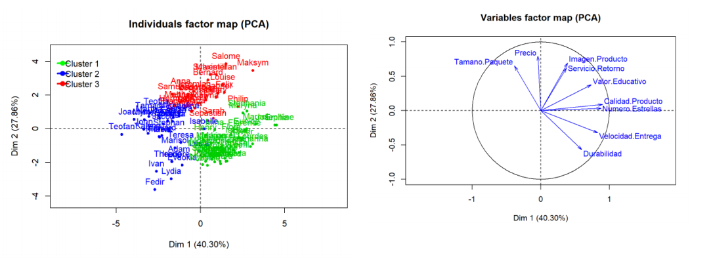
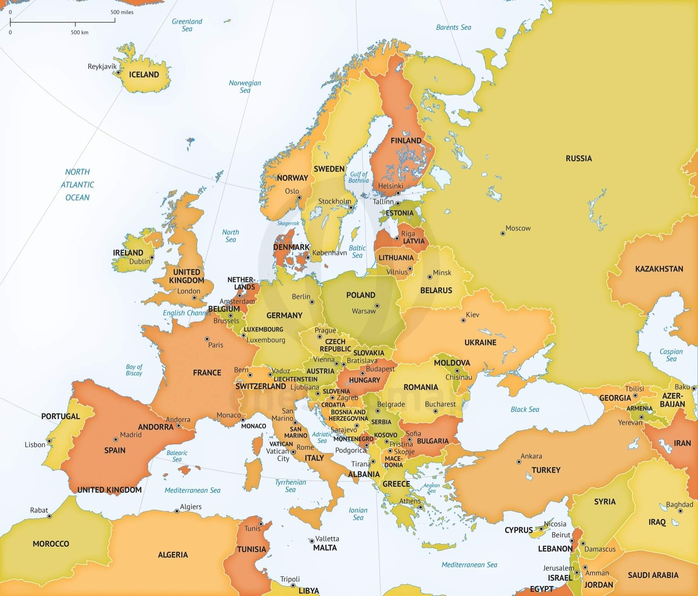

> Sede San Carlos
\
> Matematica para Ciencia de los Datos
\
> Proyecto II
\
> Autor: Andres Gonzalez
\
> 2019

``` {r echo = FALSE, message = FALSE}
library(visdat)
library(corrr) 
library(corrplot)
library(FactoMineR)
library(ggplot2)
library(factoextra)
library(rattle)
library(fmsb)
```

<hr>

### I Parte

**1.** Se le pidió a un grupo de 100 clientes que compraron el mismo producto o productos similares en la tienda de AMAZON, que evaluaran el servicio recibido desde diferentes aspectos. El archivo EjemploAlgoritmosRecomendacion.csv muestra los promedios de la evaluación dada por los clientes en relación a las variables que se pueden apreciar en el encabezado de la tabla. Para este dataset, realice lo siguiente:

|        **a)** Cargue el dataset EjemploAlgoritmosRecomendacion.csv, verifique que la lectura de los datos es correcta.

\

```{r}
algoritmos <- read.csv("datos/EjemploAlgoritmosRecomendacion.csv", sep = ";", dec = ",", header = T,row.names = 1)
head(algoritmos)
```

\

|        **b)** A manera de diagnóstico, haga una inspección de los datos presentes en el dataset y describa las variables presentes, tipos de variables, si hay datos nulos.

\

```{r}
vis_dat(algoritmos)
```

Segun el grafico anterior podemos notar que todas las celdas son valores numericos y que no existen valores nulos. Las variables corresponden a la calificacion que clientes han dado sobre el producto en diferentes puntos como por ejemplo, velocidad de entrega, precio, durabilidad, calidad del producto, etc.

\

|        **c)** Determine si existen correlaciones importantes entre las variables del dataset, utilizando alguno de los gráficos o la matriz de correlaciones vistos en clases (si desea, puede usar otra herramienta de su preferencia). Recordemos que para aplicar un ACP, es importante que existan correlaciones entre las variables.

\

```{r}
correlaciones <- round(cor(algoritmos), 2)
corrplot::corrplot(correlaciones)
```

Segun el grafico de correlaciones anterior, podemos deducir que existen varias correlaciones entre las variables. Por ejemplo existe:

\

|        **1.** Una correlacion positiva entre velocidad de entrega con valor educativo, calidad de producto y numero de estrellas.

|        **2.** Correlacion negativa entre tamano de paquete con velocidad de entrega.

|        **3.** Correlacion negativa entre durabilidad y precio.

|        **4.** Correlacion positiva entre valor educativo con calidad de producto y numero de estrellas.

|        **5.** Correlacion positiva entre servicio de retorno con imagen de producto.

|        **6.** Correlacion negativa entre durabilidad y tamano de paquete, aunque parece ser baja.

\

|        **d)** Realice un ACP usando el paquete FactoMiner, creando el plano principal y el círculo de correlaciones. Superponga ambos gráficos e identifique la cantidad de clústeres que considere apropiado. Haga un análisis descriptivo de cada clúster, indique si hay variables correlacionadas y el tipo de correlación entre estas.

\

```{r}
pca_alg <- PCA(algoritmos, scale.unit=TRUE, ncp=5, graph = FALSE)
plot(pca_alg, axes=c(1, 2), choix="ind", col.ind="red", new.plot=TRUE)
```

Haciendo un primer analisis del plano principal con los individuos, se puede observar que hay 2 areas donde parece haber una acumulacion de individuos lo que nos indica dos posibles clusters.

```{r echo = FALSE, message = FALSE}
HCPC(pca_alg, nb.clust=-1, min=2, max=3)
```

Si hacemos un analisis jerarquico de clusters, podemos observar que efectivamente hay dos clusters marcados entre los individuos, cabe notar que la funcion HCPC sugiere que sean dos clusters, esto al pasar el parametro nb.clust con -1, si se desea se puede especificar que genere 3 clusters con nb.clust=3 lo cual tiene sentido ya que parece haber una seccion de los individuos que se aleja de las variables.

```{r}
plot(pca_alg, axes=c(1, 2), choix="var", col.var="blue",new.plot=TRUE)
```

Si graficamos las variables podemos ver que las correlaciones que analisamos en la pregunta anterior son correctas, aunque difiere en que parece haber una correlacion negativa fuerte entre tamano de paquete y durabilidad.

Tambien parece haber una correlacion fuerte entre imagen de producto y servicio de retorno, aunque mas adelante en los ejercicios podremos ver que la variable servicio de retorno, no esta bien representada.

Podemos ver tambien que existe una correlacion positiva fuerte entre velocidad de entrega y durabilidad, otra bastante fuerte entre calidad de producto y numero de estrellas.

Igualmente corroboramos que efectivamente hay una correlacion negativa entre precio y durabilidad y otra entre tamano de paquete y velocidad de entrega.

```{r}
fviz_pca_biplot(pca_alg, repel = FALSE,
                col.var = "#2E9FDF", # Variables color
                col.ind = "#696969"  # Individuals color
                )
```

Analisando el grafico anterior podemos ver que un cluster tienda mas hacia las variables tamano de paquete y precio y el otro cluster tiende hacia durabilidad y velocidad de entrega.

\

|        **e)** Repita el ejercicio anterior usando el paquete FactoMineR, elimine de los gráficos los individuos con $cos^2(\Theta)\le0.2$ y las variables $cos^2(\Theta)\le0.55$ y vuelva a crear el plano principal y el círculo de correlaciones. ¿Cuáles individuos quedaron mal representados?, ¿cuáles variables quedaron mal representadas?

```{r}
cos2.ind<-(pca_alg$ind$cos2[,1] + pca_alg$ind$cos2[,2])
cos2.var<-(pca_alg$var$cos2[,1] + pca_alg$var$cos2[,2])

indmalrep <- NULL
varmalrep <- NULL

for (i in 1 : nrow(algoritmos)) {
  header <- names(cos2.ind[i])[1]
  value <- cos2.ind[i]
 ifelse(value <= 0.2, indmalrep <- cbind(matrix(c(header, value), 2, 1, TRUE), indmalrep), NA)
}

for (i in 1 : ncol(algoritmos)) {
  header <- names(cos2.var[i])[1]
  value <- cos2.var[i]
 ifelse(value <= 0.55, varmalrep <- cbind(matrix(c(header, value), 2, 1, TRUE), varmalrep), NA)
}
```

```{r}
indmalrep
```

Luego de discriminar a los individuos con cosenos cuadrados menores a 0.2, podemos ver que **Sebastian**, **Isabelle** y **Henry** estan mas representados.

```{r}
varmalrep
```

Si discriminamos las variables con cosenos cuadrados menores a 0.55 podemos ver que **Servicio.Retorno** esta mal representado

```{r}
fviz_pca_ind(pca_alg,
             col.ind = "cos2", # Color by the quality of representation
             gradient.cols = c("#00AFBB", "#E7B800", "#FC4E07"),
             repel = FALSE     # Avoid text overlapping
             )

fviz_pca_var(pca_alg,
             col.var = "cos2", # Color by the quality of representation
             gradient.cols = c("#00AFBB", "#E7B800", "#FC4E07"),
             repel = FALSE     # Avoid text overlapping
             )
```

Analisado los graficos anteriores que marcan los individuos y variables basado en los cosenos cruadrados por color, podemos corroborar que effectivamente **Sebastian**, **Isabelle** y **Henry** estan mal representados y **Servicio.Retorno** en las variables.

\

|        **f)** Realice un gráfico radar (araña) usando 3 clústeres e interprete cada uno de los clústeres. 

```{r}
modelo <- hclust(dist(algoritmos),method= "ward")
centros<-centers.hclust(algoritmos,modelo,nclust=3,use.median=FALSE)
rownames(centros)<-c("Cluster 1","Cluster 2","Cluster 3")
centros<-as.data.frame(centros)
maximos<-apply(centros,2,max)
minimos<-apply(centros,2,min)
centros<-rbind(minimos,centros)
centros<-rbind(maximos,centros)
radarchart(centros,maxmin=TRUE,axistype=4,axislabcol="slategray4",
           centerzero=FALSE,seg=8,cglcol="gray67",
           pcol=c("blue","red","green"),
           plty=1,
           plwd=5,
           title="Comparación de clústeres")

legenda <-legend(1.5,1, legend=c("Cluster 1","Cluster 2","Cluster 3"),
                 seg.len=-1.4,
                 title="Clústeres",
                 pch=21, 
                 bty="n" ,lwd=3, y.intersp=1, horiz=FALSE,
                 col=c("blue","red","green"))
```

Analisando el grafico arana, podemos ver que los individuos del cluster 1 dieron mejor calificacion a el tamano del paquete y un poco en el precio.

Los individuos del cluster dos, dieron buenas calificaciones en precio, valor educativo y tamano de paquete, y bajo en durabilidad lo cual concurda con el analisis de correlaciones que hicimos previamente.

Los individuos del cluster tres, dieron buenas calificaciones en durabilidad, velocidad de entrega, numero de estrellas, calidad de producto y valor educativo lo cual concuerda con nuestro analisis de correlaciones positivas. Tambien se puede notar que es bajo en calificacion de tamano de paquete lo cual concuerda con el analisis de correlaciones negativas

\

|        **g)** Suponga que se trabajaron los datos con 3 clústeres, como se muestra en el plano principal siguiente:

<center></center>

\

Partiendo del hecho de que todos los individuos compraron, ya sea el mismo producto o similares, pero, cada uno tuvo una experiencia de compra diferente que pudo ser mejor o peor en los diferentes rubros de la evaluación,

* ¿Qué productos recomendaría a Salome?
* ¿Qué productos recomendaría a Stephania?
* ¿Qué productos recomendaría a Lydia?

Es decir, los mismos productos que compró cuál otro cliente.

Si hacemos un analisis con los dos graficos anteriores y el grafico de arana de la pregunta f, podemos recomendar a **Salome** que esta dentro del cluster 3 que compre productos con buena calificaciones en durabilidad y precio, pero tambien en tamano de paquete, valor educativo y por ultimo en calidad de producto.

Por otra parte a **Stephania**, esta dentro del cluster 1, por lo cual se le pueden recomendar productos con calificaciones altas en calidad de producto y valor educativo si nos basamos en el grafico circulas de variables, aunque basado en el grafico de arana podriamos tambien recomendar productos dentro de ese cluster, como por ejemplo calificaciones altas en  durabilidad, numero de estrellas y velocidad de entrega.

A **Lydia** que esta en el cluster dos se le pueden recomendar productos con calificaciones altas en tamano de paquete y considerar tambien el precio, basado en el grafico arana.

\

### II Parte

Considérese tabla datos ConsumoEuropa.csv que contiene una estimación del consumo promedio de proteínas, en gramos, por persona y por día, en Europa, datos del año 1981.

|        **a)** Usando FactoMineR efectúe un ACP para esta tabla de datos

\

```{r}
europa <- read.csv("datos/ConsumoEuropa.csv", sep = ";", dec = ",", header = T,row.names = 1)
head(europa)
pca_eu <- PCA(europa, scale.unit=TRUE, ncp=5, graph = FALSE)
```
\

|        **b)** Grafique el plano principal y el círculo de correlaciones, luego compare este Plano Principal con el mapa de Europa ¿Qué conclusiones puede sacar?

```{r}
plot(pca_eu, axes=c(1, 2), choix="ind", col.ind="red", new.plot=TRUE)
plot(pca_eu, axes=c(1, 2), choix="var", col.var="blue",new.plot=TRUE)
fviz_pca_biplot(pca_eu, repel = FALSE,
                col.var = "#2E9FDF", # Variables color
                col.ind = "#696969"  # Individuals color
                )
HCPC(pca_eu, nb.clust=4, min=2, max=5)
```

```{r}
modelo <- hclust(dist(europa),method= "ward")
centros<-centers.hclust(europa,modelo,nclust=4,use.median=FALSE)
rownames(centros)<-c("Cluster 3","Cluster 4","Cluster 1", "Cluster 2")
centros<-as.data.frame(centros)
maximos<-apply(centros,2,max)
minimos<-apply(centros,2,min)
centros<-rbind(minimos,centros)
centros<-rbind(maximos,centros)
radarchart(centros,maxmin=TRUE,axistype=4,axislabcol="slategray4",
           centerzero=FALSE,seg=8,cglcol="gray67",
           pcol=c("green","blue","black", "red"),
           plty=1,
           plwd=5,
           title="Comparación de clústeres")

legenda <-legend(1.5,1, legend=c("Cluster 3","Cluster 4","Cluster 1", "Cluster 2"),
                 seg.len=-1.4,
                 title="Clústeres",
                 pch=21, 
                 bty="n" ,lwd=3, y.intersp=1, horiz=FALSE,
                 col=c("green","blue","black", "red"))
```

<center></center>

\

Haciendo un analisis del mapa y el grafico de individuos y variables superpuesto, parece existir un cluster de individuos (cluster 1 negro) que incluye a **Romania*, **Bulgaria**, **Albania** y **Yuguslavia**, donde se consume mucho los cereales y lo interesante es que en el mapa se encuentran uno muy cerca del otro, mejor dicho comparten fronteras. Tambien basado en el grafico arana este cluster parece consumir tambien muchas semillas.

Luego podemos ver el caso de **Polonia**, **Checoslovaquia**, **Hungria**, **URSS** y **Alemania Oriental**, que se encuentran muy juntos en el mapa y son parte de un cluster (cluster 3 verde), estos paises no parecen estar inclinados hacia algun tipo especifico de comida, se enncuentran muy centraliados entre los diferentes tipos de variables y de hecho en el mapa estan muy rodeados de el resto de paises por lo que posiblemente se ven influienciamos por muchos tipos de cocina. Si vemos el grafico arana, se puede observar como el consumo es variado, un poco mas vajo en carne de pescado, tal ves por el hecho de que se encuentran alejados de zonas costeras.

Siguiente tenemos a paises como **Francia**, **Belgica**, **Reino Unido**, **Alemania Occidental**, **Irlanda**, **Finlandia**, **Holanda**, **Suiza**, y **Austria**, que son parte del cluster 4 de color azul. Estos paises tambien comparten fronteras y tienen un consumo muy similar si analisamos el grafico de individuos y variables superpuesto. Es aun mas claro si vemos el grafico de arana, donde vemos que el este cluster tiene un consumo alto en Leche, Huevo, Carne de cerdo, cerne de animal y un poco de almidon.

Por ultimo el cluster 2 de color rojo, es muy interesante ya que paises como **Espana**, **Portugal**, **Noruega**, **Italia** y **Grecia**, aunque algunos comparten fronteras y otros parecen estar mas alejados, tienen en comun que son paises con zonas costeras y si analizamos el grafico de arana, se puede apreciar que el consumo de carne de pescado es alto en este cluster de paises. Tambien el almidon lo cual puede explicar el consumo un poco menor del cluster 4 ya que son paises relativamente cerca del cluster 2. El consumo de Frutas y huevos tambien son considerables en este cluster.

En cloncusion podemos deducir

* En zonas costeras es mas alto el consumo de carne de pescado, almidon y frutas. 
* Entre mas centrales sean los paises mas variado es el consumo.
* En paises europeos de occidente es mas alto el consumo de carne de cerdo, animal, huevos y leche.
* En paises al sur de Europa el consumo de cereales y semillas es mayor, y en zonas de occidente es menor, aqui entonces tenemos una correlacion negativa, entre mas el consumo de semillas y cereales, menor es el consumo e carnes, huevo y leche.